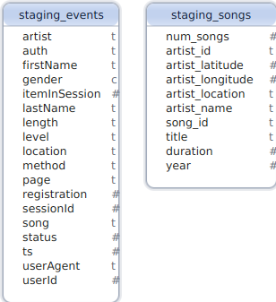
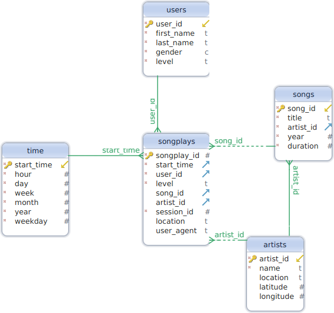

# Data Modeling with Postgres

## **Overview**

The objective of this project is provide a ETL pipeline using python that extract the data from the Milling dataset 
and insert this information on the Redshift database for his later analysis.


## **Song Dataset**
Songs dataset is a subset of [Million Song Dataset](http://millionsongdataset.com/).

Sample Record :
```
{"num_songs": 1, "artist_id": "ARJIE2Y1187B994AB7", "artist_latitude": null, "artist_longitude": null, "artist_location": "", "artist_name": "Line Renaud", "song_id": "SOUPIRU12A6D4FA1E1", "title": "Der Kleine Dompfaff", "duration": 152.92036, "year": 0}
```

## **Log Dataset**
Logs dataset is generated by [Event Simulator](https://github.com/Interana/eventsim).

Sample Record :
```
{"artist": null, "auth": "Logged In", "firstName": "Walter", "gender": "M", "itemInSession": 0, "lastName": "Frye", "length": null, "level": "free", "location": "San Francisco-Oakland-Hayward, CA", "method": "GET","page": "Home", "registration": 1540919166796.0, "sessionId": 38, "song": null, "status": 200, "ts": 1541105830796, "userAgent": "\"Mozilla\/5.0 (Macintosh; Intel Mac OS X 10_9_4) AppleWebKit\/537.36 (KHTML, like Gecko) Chrome\/36.0.1985.143 Safari\/537.36\"", "userId": "39"}
```


## Schema

#### Staging Tables



**staging_events** - records from logs dataset
```
artist, auth, firstName, gender, itemInSession, lastName, length, level, location, method, page, registration, sessionId, song, status, ts, userAgent, userId
```
**staging_songs** - records from the songdataset
```
num_songs, artist_id, artist_latitude, artist_longitude, artist_location, artist_name, song_id, title, duration, year
```

#### Fact Table 



**songplays** - records in log data associated with song plays i.e. records with page `NextSong`

```
songplay_id, start_time, user_id, level, song_id, artist_id, session_id, location, user_agent
```

#### Dimension Tables
**users**  - users in the app
```
user_id, first_name, last_name, gender, level
```
**songs**  - songs in music database
```
song_id, title, artist_id, year, duration
```
**artists**  - artists in music database
```
artist_id, name, location, latitude, longitude
```
**time**  - timestamps of records in  **songplays**  broken down into specific units
```
start_time, hour, day, week, month, year, weekday
```

## Project Files

- ```dwh.cfg``` -> contains the configuration information to be able to connect and sync the information. 
This is not present in the repository
 
```
[CLUSTER]
HOST=
DB_NAME=
DB_USER=
DB_PASSWORD=
DB_PORT=

[IAM_ROLE]
ARN=

[S3]
LOG_DATA=s3://udacity-dend/log_data
LOG_JSONPATH=s3://udacity-dend/log_json_path.json
SONG_DATA=s3://udacity-dend/song_data
```

- ```sql_queries.py``` -> contains sql queries for dropping and creating fact and dimension tables. Also, contains insertion query template.

- ```create_tables.py``` -> contains code for setting up the tables. Running this file creates the staging and the fact and dimension tables.

- ```etl.py``` -> Process **song_data** and **log_data**, input this information initially to staging tables and lastly to the fact and dimension tables.

## Environment 
Python 3.6 or above

Redshift

psycopg2 - PostgreSQL database adapter for Python


## How to run

Run the follow commands as below.
```
python create_tables.py 
python etl.py 
``` 

#### Reference: 
[Psycopg](http://initd.org/psycopg/docs/)

[RedShift Documentation](https://docs.aws.amazon.com/redshift/index.html)

